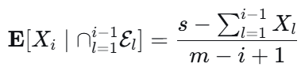
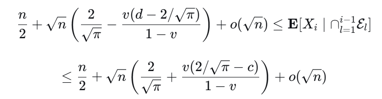
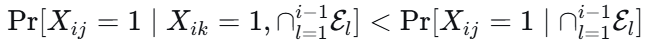
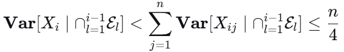
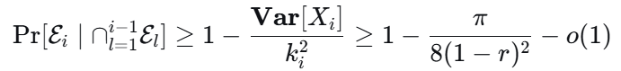
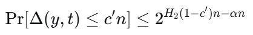
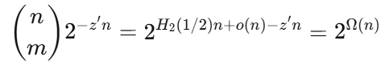

## 论文标题：
Optimal Space Lower Bounds for all Frequency Moments

## 作者：
David Woodruff (MIT)

## 发表：
SODA 2004

## 核心：
证明了对于任意实数 k!=1和任意 ϵ=Ω(1/m)，任何单遍随机化流算法若要以相对误差ϵ近似第k个频率矩 Fk，必须使用 Ω(1/ϵ^2)比特空间。这是关于 ϵ 的最优下界。

## 论文解决了什么问题
**问题定义**
数据流模型下，算法按顺序读取m个元素，每个元素属于全集[m]。设fi为元素i的出现次数。第k个频率矩定义为Fk=∑m fi^k。算法的目标是输出F~k，满足⁡Pr[∣F~k​−Fk∣>ϵFk]<δ。论文要回答的核心问题是：
对于单遍随机化流算法，近似Fk（k≠1）到底需要多少空间（作为 ϵ 的函数）？

**论文贡献**
论文证明了下界Ω(1/ϵ^2) 对所有实数k≠1和所有ϵ=Ω(1/sqrt(m)) 成立。这是该问题在ϵ依赖关系上的最优下界——因为已知的算法已经达到O(1/ϵ^2⋅polylog(m)) 空间，上下界在ϵ的指数上完全匹配。
论文还顺便解决了：
- 汉明距离近似的一向通信复杂度：首次给出关于ϵ的最优下界。
- 二部图计数：证明每行每列多数为 1 的二部图数量至少2^(mn−zm−n)（z<1）

**前人工作的局限**
此前唯一的Ω(1/ϵ^2) 下界来自 Indyk 和 Woodruff 2003 的工作，但仅适用于F0，且仅对ϵ=Ω(m^(1/(9+c)))（任意c>0）成立——即要求 ϵ不能太小（相对于m而言不能小于约m^(−1/9)）。对于更小的ϵ即更高精度要求），该下界不成立。
Bar-Yosef 等人 [3, 4] 明确将Ω(1/ϵ^2) 下界能否扩展到所有k≠1和所有ϵ范围作为开放问题。本文正是解决了这个开放问题。

## 该问题为什么重要
**频率矩是数据流分析的基础**
频率矩是数据流中最基本的统计量之一。Alon、Matias 和 Szegedy 1996 年的开创性论文不仅提出了频率矩估计问题，还奠定了整个流算法领域的理论基础，该工作因此获得了 2005 年 Gödel 奖。
具体应用包括：
F0（不同元素个数） ：数据库查询优化器用于估计“SELECT DISTINCT”的结果大小，避免昂贵的排序操作。
F2（重复率/Gini 同质性指数） ：用于确定数据库自连接的输出大小，以及计算数据序列的“惊奇指数”。
高阶矩 Fk（k>2）：用于检测数据偏斜度，在并行数据库的负载均衡中至关重要。
**下界问题的重要性**
上界（算法）告诉你“可以做到多好”，下界告诉你“不可能做得更好”。只有两者匹配，问题才算被真正理解。
在本文发表前，频率矩估计的空间复杂度在ϵ依赖关系上存在巨大缺口：上界是O(1/ϵ^2)，下界最好的也只是Ω(1/ϵ)（对F0）或带有额外限制的Ω(1/ϵ^2)。这个缺口意味着没人知道是否可能存在O(1/ϵ) 甚至O(log(1/ϵ)) 的算法。本文填补了这个缺口，证明1/ϵ^2的依赖是不可避免的。
**技术意义**
论文证明了Ω(1/ϵ^2) 下界对所有 k≠1成立，这揭示了频率矩估计问题的一个深刻统一性：无论你关心的是不同元素个数（k=0）、重复率（k=2）还是更高阶矩，在 ϵ 的依赖上难度完全相同——都是Θ(1/ϵ^2)。唯一的例外是k=1（即流的总长度），它可以直接精确计算，因此不需要近似。
**对相关领域的推动**
汉明距离近似是通信复杂度和流算法的核心问题。本文给出的Ω(1/ϵ^2) 一向通信复杂度下界是首个关于ϵ的最优下界，为后续研究（如 Gap-Hamming 问题的通信复杂度）奠定了基础。
二部图计数下界虽然只是推论，但它是此类二部图计数的首个非平凡下界，比 Kleitman 定理直接给出的界更强。

## 相关研究
**论文中提到的相关工作**
Alon-Matias-Szegedy (AMS96) ：开创性论文，首次提出频率矩估计问题，给出了F0、F2和一般Fk的算法及初步下界。

Bar-Yosef 等人 [3, 4]：给出了F0的Ω(1/ϵ) 下界，并将Ω(1/ϵ^2) 下界的推广列为开放问题。

Indyk-Woodruff (FOCS 2003) ：对F0证明了Ω(1/ϵ^2) 下界，但仅对ϵ=Ω(m^(1/(9+c)))。本文的直接前作。

Kleitman 定理 ：论文用于证明矩阵行/列条件概率的关键工具。

Kremer-Nisan-Ron (1999) ：提出了用 shatter 系数下界通信复杂度的方法（定理 2.1）。

**论文未提到的相关研究**
Indyk-Woodruff (STOC 2005) ：给出了k>2 时Fk的O~(m^(1−2/k))空间算法，与已知下界匹配，解决了 AMS 留下的主要开放问题。

Kane-Nelson-Porat-Woodruff (2010) ：给出了空间最优且更新时间快的频率矩估计算法。

Nelson-Woodruff (2011) ：解决了 AMS 论文中关于大频率矩（k>2）的剩余开放问题。

Andoni-Nguyễn-Polyanskiy-Wu (2013) ：对线性 Sketch 类算法证明了Fp（p>2）的紧下界Ω(n^(1−2/p) logn)。

Li-Woodruff (2013) ：给出了高频率矩在小误差情况下的紧下界。

Braverman-Zamir (2024/2025) ：解决了F2在小误差（ϵ<1/sqrt(n)）情况下的最优空间复杂度，证明最优空间为Θ(min(n,1/ϵ^2)⋅(1+∣log(ϵ^2 n)∣))。这是对本文结果的补充——本文的下界适用于ϵ=Ω(1/sqrt(n))，而 Braverman-Zamir 处理了ϵ=o(1/sqrt(n)) 的“小误差”区间。

Jayram-Woodruff (2011) ：将信息复杂度方法用于流算法下界，首次得到依赖于错误概率δ的下界。

噪声流模型 ：Liu 和 Zhang 将频率矩估计推广到噪声数据 setting，证明噪声环境下F2需要多项式空间。

量子频率矩 ：研究了量子计算模型下频率矩估计的复杂度。

多遍流算法 ：Braverman-Zamir 证明了单遍与常数遍之间在F2小误差估计上存在渐近分离。

## 论文提出了什么技术
**核心技术**
论文的核心技术贡献是直接证明一个汉明距离承诺问题L的一向通信复杂度为Ω(1/ϵ^2)。
此前 Indyk-Woodruff 无法直接下界该问题的复杂度，而是通过“低失真嵌入”将其归约到几何问题，这导致了额外的限制条件（ϵ不能太小）。本文绕过了这一障碍，直接用 shatter 系数下界了L的通信复杂度。

**关键技术工具**
Shatter 系数 + 主要定理
论文的核心技术链条是：
- 主要定理（定理 3.1） → Shatter 系数下界（定理 3.2） → 通信复杂度下界（定理 2.1） → 流算法空间下界
主要定理（定理 3.1）本身是通过精巧的概率方法证明的，它构造了一个具有2^Ω(n)个好子集的点集S。每个好子集T对应一个码字yT，能将T与S∖T 在汉明距离意义下分离。这本质上是在高维超立方体中构造了一个大族可线性分离的子集。

**主要定理证明中的技术细节**
- Kleitman 定理的应用：将矩阵的行事件R1,R2和列事件C视为单调集合族，用 Kleitman 定理将交集概率分解。
- 条件期望的精细计算：在给定前 i−1 行满足条件 E 1 ,…, E i−1 以及列条件C和总 1 数Y=s 的条件下，精确计算第i行中 1 的期望数。这需要处理超几何分布的期望，并选择了巧妙的参数v=(sqrt(2)−1)/(2sqrt(2)−1)。

- 负相关性（引理 4.2） ：证明矩阵同一行中不同列的条目在给定条件下是负相关的。这保证了方差的上界 ≤n/4，从而切比雪夫不等式有效。

- 多重集修正：用 union bound 处理随机选取S时可能产生重复元素的问题

- 参数选择：通过选择r>0 足够小，使最终的对数概率严格大于−1。这需要连续性论证——在r=0 时表达式大于−1，因此存在r>0 保持该性质。

## 技术背后的直觉
**为什么是Ω(1/ϵ^2)**
Ω(1/ϵ^2)下界的直觉来自统计估计的样本复杂度：要区分两个概率p和p+ϵ，需要Ω(1/ϵ^2)个样本。频率矩估计本质上是在估计分布的各阶矩，而矩估计的精度受限于统计波动。
具体到本文的证明,Ω(1/ϵ^2)来自于t=Θ(1/ϵ^2) 个点的汉明距离承诺问题。要区分距离≤t/2−sqrt(t)和>t/2，需要Ω(t)=Ω(1/ϵ^2)比特通信

**为什么需要构造特殊的点集S**
通信复杂度下界通常通过 shatter 系数获得：如果函数族F在l个点上能产生2^Ω(l)种不同模式，则通信复杂度至少Ω(l)。
问题在于：对于任意随机点集，好子集的数量可能不够大。论文需要证明存在一个特定的点集S，使得好子集数量指数级大。概率方法在此发挥作用——随机选择的点集以高概率具有这个性质。

**为什么多数码字是自然选择**
对于给定的子集T，论文选择y为T中向量的逐位多数（majority codeword）。这个选择是自然的，因为多数码字在某种意义上“代表”了T的中心：T中每个向量与 y的距离期望约为n/2−O(sqrt(n))（因为每个位置有约一半的向量与多数不同），而T外随机向量与y的距离期望约为n/2

**“好子集”的几何直觉**
“好子集” T要求存在一个码字yT，它离T中所有点“适度近”（距离在[c′n,n/2−c sqrt(n)] 之间），但离T补集中所有点“远”（距离>n/2）。
这本质上是在说：在高维超立方体中，存在一个点集S和大量子集T，使得每个T都能被一个超平面（在汉明度量下表现为一个中心点yT的球）从补集中分离出来。Shatter 系数大意味着这个点集S具有很高的“表达能力”——它能被大量不同的二分方式所区分。

**Kleitman 定理的角色**
Kleitman 定理说的是两个单调递增集合族的交集概率至少是各自概率的乘积。在矩阵M的分析中，行条件（每行有很多 1）和列条件（每列有很多 1）都是单调事件。Kleitman 定理允许我们将行条件和列条件的联合概率分解，大大简化了计算。

## 技术的亮点与贡献
**最优性**
论文证明的下界Ω(1/ϵ^2) 与已知上界O(1/ϵ^2 ⋅ polylog(m))在ϵ的依赖上完全匹配。这意味着关于ϵ的问题被彻底解决——不可能有任何算法能在ϵ的依赖上做得更好。

**通用性**
下界对所有实数k≠1成立。这揭示了频率矩估计问题的一个深刻结构：无论是一阶矩（k=0，不同元素）、二阶矩（k=2，重复率）还是更高阶矩，在近似误差ϵ的依赖上难度完全相同。唯一的例外是k=1（流的总长度），不需要近似。

**克服的技术障碍**
此前 Indyk-Woodruff 只能对F0且仅在ϵ=Ω(m^(1/(9+c)))时证明Ω(1/ϵ^2)。本文通过直接下界通信复杂度，绕过了低失真嵌入带来的限制，将下界推广到所有ϵ=Ω(1/sqrt(m))

**方法的新颖性**
论文的方法结合了多个看似不相关的数学工具：
- Shatter 系数（来自学习理论 / VC 维）
- Kleitman 定理（来自极值组合学）
- 概率方法（来自随机图论）
- 负相关性（来自概率论）
这种跨领域的工具组合在当时的流算法下界研究中是新颖的，之前没有被广泛使用。

**额外成果**
论文的主要定理自然导出了两个额外的重要结果：
- 汉明距离近似的一向通信复杂度下界——这是该问题首个关于ϵ的最优下界。
- 二部图计数下界——这是首个非平凡下界，比 Kleitman 定理的直接应用更强

## 技术实现的详细解析

**整体框架**
- 层次一（主要定理） ：构造点集S，证明存在大量好子集。
- 层次二（通信复杂度） ：用主要定理证明汉明距离承诺问题的通信复杂度Ω(1/ϵ^2)。
- 层次三（流算法下界） ：将通信复杂度下界转化为频率矩近似算法的空间下界。

**主要定理证明中的技术细节**
步骤 1：随机选择与定义
随机（有放回）选择n个向量r1,…,rn∈{0,1}^n，构成S。对任意大小为m=⌈n/2⌉的子集T={r1,…,rm}，定义y=yT为逐位多数：
> yj=majority(r_1j,…,r_mj)
由于映射x↦ xˉ⊕y 保持汉明距离，不妨设y=1^n（全 1 向量）。

步骤 2：分解概率
T是“几乎好”的（即满足除下界c′n 外的所有条件）的概率为：
> Pr[∀t∈S∖T,Δ(y,t)>n/2]⋅Pr[∀t∈T,Δ(y,t)≤n/2−c sqrt(n)]
第一项=2^(m−n) ，因为y独立于S∖T。

步骤 3：矩阵表示与行/列事件
将 T的m个向量排列成m×n矩阵M。设m=m1​+m2，其中m1=vm（v<1/2 待定）。
定义三个事件：
- R1：前m1行每行至少有n/2+c sqrt(n)个 1
- R2：后m2行每行至少有n/2+c sqrt(n)个 1
- C：每列至少有m/2 个 1
注意：R1∩R2正是 ∀t∈T,Δ(y,t)≤n/2−c sqrt(n)。

步骤 4：应用 Kleitman 定理
将M视为[mn] 的子集的特征向量。R1,R2,C 都是单调递增的集合族。由 Kleitman 定理：
> Pr[R1∩R2∩C]≥Pr[R1∩C]⋅Pr[R2]
因此：
> Pr[R1∩R2∣C]≥Pr[R1∣C]⋅Pr[R2]

步骤 5：计算Pr⁡[R2]
R2只涉及独立的m2行，每行是n个独立无偏伯努利变量的和。由引理 2.1：
> Pr[R2]>(1/2 -c sqrt(2/π))^m2

步骤 6：计算Pr[R1∣C]
令Y为M中 1 的总数。由引理 2.2，在给定C的条件下，每列 1 的期望为 m/2+ sqrt(2m/π) (1+o(1))。因此：
> E[Y∣C]= nm/2 + n sqrt(2m/π) (1+o(1))
由切比雪夫不等式Y高度集中于此值附近：
> Pr[Y= nm/2 +n sqrt(2m/π) (1+o(1))∣C]=1−o(1)
令s为此集中值。则：
> Pr[R1∣C]≥(1−o(1))Pr[R1∣Y=s,C]

步骤 7：条件期望的计算
在给定Y=s 和 C的条件下，考虑第i行（1≤i≤m1）中 1 的期望数。由对称性，在给定前i−1 行满足条件 E1,…,Ei−1 时：
>  
利用∑ l=1->i−1 Xl 的上下界，经过代数运算得到：
> 
其中c=2r/sqrt(π)，d=2(2−r)/sqrt(π)。

步骤 8：负相关性（引理 4.2）
关键引理证明同一行中不同列是负相关的：
> 
证明思路：在给定第i行总共有t个 1 的条件下，所有t-组合等可能。知道某一列是 1 会略微降低另一列是 1 的条件概率（因为“名额”少了一个）。由此：
> 
 
步骤 9：切比雪夫不等式
定义ki为期望到区间端点的最小距离：
> ki=min{E[Xi]−n/2−c sqrt(n),n/2 + d sqrt(n) − E[Xi]}
由切比雪夫不等式：
> 

步骤 10：参数选择
选择v=(sqrt(2)−1)/(2sqrt(2)−1)<1/2。在r=0 时，对数概率除以n为：
> −1+ v/2 (1+log2(1− π/8 −o(1)))+log2(1−o(1))
由于=1−π/7>1/2，该值大于−1。由连续性，存在r>0 使该性质保持。因此存在常数z<1 使：
> Pr[T 几乎好]>2^(−zn)
 
步骤 11：处理下界条件
还需保证对t∈T，Δ(y,t)≥c′n。由 Chernoff 界，对单个t：
> 
选择c′足够小、α足够接近 1，使坏事件概率可被吸收。最终：
> Pr[T 好]>2^(−z′n)
其中z′<1。

步骤 12：期望论证
好子集的期望数量为：
> 
因此存在S具有2^Ω(n)个好子集。多重集问题用 union bound 处理。

**从主要定理到通信复杂度下界**
Shatter 系数下界（定理 3.2）：对每个好子集T，对应的yT定义了一个函数f_yT:S→{0,1}，其中f_yT(s)=0 若s∈T，否则为 1。不同T给出不同函数。因此函数族在全集S上的不同模式数为2^Ω(n)
 ，shatter 系数为2^Ω(n)。

通信复杂度下界（推论 3.1）：由定理 2.1，取l=n/4，得到 Dμ,δ(f)≥log(2^Ω(n))−(n/4)H2(δ)=Ω(n)。由 Yao 极小极大原理，Rδ(f)=Ω(n)=Ω(1/ϵ^2)。

**流算法下界**
核心等式（公式 3.1）：
> Fk(ay∘as)=2^(k−1) (wt(y)+wt(s))+(1−2^(k−1))Δ(y,s)
因此：
> Δ(y,s)= (2^(k−1))/(2^(k−1))*(wt(y)+wt(s))−(Fk(ay∘as))/(2^(k−1) −1)
误差传播分析：需要证明Fk的(1±ϵ′) 近似足以给出Δ(y,s) 的(1±ϵ) 近似。
对于k<1，条件为：
> ϵ′≤(ϵ(2^(k−1) −1)Δ(y,s))/(2^(k−1)*(wt(y)+wt(s)))
对于k>1，条件为：
> ϵ′≤(ϵ(2^(k−1) −1)Δ(y,s))/(Fk(ay∘as))
由于Δ(y,s)≥c′n（由主要定理保证）且wt(y)+wt(s)=O(n)、Fk=O(n)，存在ϵ′=Θ(ϵ) 使条件满足。

通信开销：除Fk近似算法的状态外，还需传输wt(y)（logn=O(logm) 比特）。如果logm=ω(1/ϵ^2)，这个额外开销被已知的 Ω(logm) 下界吸收。因此Fk近似算法本身必须使用Ω(1/ϵ^2) 空间。

## 证明的正确性验证要点
- Kleitman 定理的应用条件：R1,R2,C 是否确实是单调递增的？是——如果一行已经有足够多 1，增加更多 1 不会破坏该性质。
- 条件期望计算中的o(sqrt(n)) 项：这些项来自斯特林近似和超几何分布的期望计算，在n→∞ 时趋于 0。
- 负相关性的严格性：引理 4.2 的证明依赖于“在给定Xi=t 的条件下，所有t-组合等可能”这一对称性论证。这是严格的。
- 多重集修正：碰撞概率2^(−n+O(logn))，在n足够大时远小于2^(−z′n)，不影响结论。
- 误差传播的代数正确性：公式 3.1 的推导和ϵ′的选择条件可以逐行验证。
- Ω(logm) 下界的吸收：已知Fk（k≠1）有Ω(logm) 下界。如果 logm=ω(1/ϵ^2)，则Ω(1/ϵ^2) 下界被吸收；否则传输wt(y) 的logm=O(1/ϵ^2) 比特不改变下界量级。
